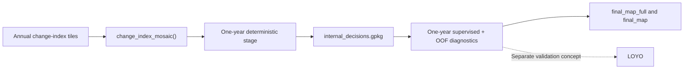

# Front Matter

This book documents the current OtsuFire workflow as supported by the paper draft, the example usage drivers under `00_USAGE`, and the package implementation under `OtsuFire/R` (the canonical runtime). It is therefore both a methods guide and a project-state tutorial.

When those sources disagree, the text follows the most explicit current implementation state recorded in the handoff and in the active package and runner logic. Sections that are still conceptually present but not yet operationally documented are left as explicit TODO items instead of being reconstructed from guesswork.

## Workflow At A Glance

The current operational workflow is centered on annual mapping. LOYO remains a separate cross-year validation concept and is not the same as the one-year OOF diagnostics described later in this book.

## Current Entry Points

| Task | Current entry point | Current status |
|---|---|---|
| Annual mosaic | `change_index_mosaic()` | Package-facing mosaic function |
| One-year deterministic | `build_burned_mapping_config()` + `run_deterministic_pipeline()` | Canonical package runtime |
| One-year supervised | `build_supervised_burned_config()` + `run_oneyear_supervised_pipeline()` | Canonical package runtime (fully package-internal) |
| Validation utility | `validate_fire_maps()` | Shared modular utility for compatible burned-area prediction layers, including deterministic outputs and thresholded supervised `p_burned` outputs |
| LOYO | (none) | Separate temporal-validation concept; a new dedicated multiyear runtime is still pending |

## Terminology Used In This Book

- `change_index` is the package-facing generic term for the annual burned-sensitive raster. In the current annual runtime this is usually the `MinMin_<year>_mosaic_res90m.tif` mosaic.
- `deterministic stage` means the rule-based annual stage that writes the canonical `internal_decisions` layer.
- `one-year supervised` means the current operational annual supervised workflow, including same-year OOF diagnostics.
- `usage driver` means an example script under `00_USAGE` that builds a config and calls the package functions. The package functions in `OtsuFire/R` are the runtime (fully package-internal); they do not source external scripts.
- `LOYO` means a separate temporal-validation design. It should not be confused with the within-year OOF outputs.

## How To Read This Book

Chapter 0 introduces the project architecture, the two-stage methodological design, and the current validated operational state. Chapter 1 explains how annual change-index tiles become a single analysis-ready mosaic. Chapter 2 documents the deterministic stage as the first annual decision block. Chapter 3 documents the supervised stage and explicitly separates one-year OOF diagnostics from still-pending LOYO documentation. Chapter 4 gives a practical one-year workflow tutorial. Chapter 5 collects troubleshooting notes grounded in the current scripts and handoff.

Each chapter is written to be readable on its own, but the preferred reading order is the actual runtime order: mosaic -> deterministic -> supervised -> annual workflow tutorial -> troubleshooting.

::: {.callout-note}
LOYO and historical application are still part of the project concept, but the sources available for this pass do not yet support a fully operational step-by-step tutorial for those workflows. This book therefore documents them only at the level currently supported by the paper draft, the handoff, and the active code.
:::
